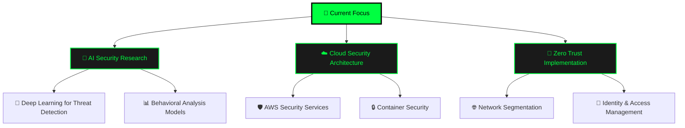

<div align="center">
  
# 🔐 Oussama AHJLI - Cybersecurity & AI Specialist


[](https://oussama-ahjli.vercel.app/)
[](https://www.linkedin.com/in/oussama-ahjli/)
[](mailto:ahjli.contact@gmail.com)
[](https://github.com/SaamNoLimits)


</div>

---

## 🎯 **About Me**

<div align="center">


</div>

<table>
<tr>
<td width="50%">

### 🤖 **System Initialize...**


</td>
<td width="50%">

### 🛡️ **Security Arsenal Loading...**


<div align="center">

**🔄 Initializing Security Modules...**


</div>

</td>
</tr>
</table>

<div align="center">

### 💻 **Terminal Session Active**

```bash
┌──(oussama㉿security-lab)-[~/cybersec-projects]
└─$ whoami && echo "Current Mission: Making AI-Powered Security Accessible"

🔐 Cybersecurity & AI Specialist
🇲🇦 Based in Morocco
🎯 Current Mission: Making AI-Powered Security Accessible

┌──(oussama㉿security-lab)-[~/expertise]
└─$ cat skills.json
{
  "primary_focus": ["🛡️ Threat Detection", "🤖 AI Security Solutions"],
  "specialties": {
    "security": ["🔍 Malware Analysis", "🌐 Network Security", "🎣 Phishing Detection"],
    "ai_ml": ["📊 Security Automation", "🧠 Behavioral Analysis", "⚡ Real-time Processing"],
    "infrastructure": ["🏗️ DevSecOps", "☁️ Cloud Security", "🔐 Zero Trust Architecture"]
  },
  "current_projects": "6 Active Security Solutions",
  "threat_level": "🟢 All Systems Secure"
}

┌──(oussama㉿security-lab)-[~/current-focus]
└─$ python3 current_mission.py --status
🚀 ACTIVE MISSIONS:
  ├── 🔬 Research: AI/ML Advanced Threat Detection
  ├── 🤖 Building: Automated Security Response Systems  
  ├── 📖 Learning: Zero Trust Architecture Implementation
  └── 🎯 Goal: Democratizing Cybersecurity with AI

💡 Status: Ready for new challenges and collaborations!
```

</div>

<div align="center">

### ⚡ **Real-Time Security Status**


**🌟 "I turn complex security challenges into elegant AI-driven solutions" 🌟**

</div>

---

## 🛠️ **Tech Arsenal**

<div align="center">

### 🔐 **Cybersecurity Tools**


### 🤖 **AI/ML & Data Science**


### 💻 **Development & DevOps**


### 🗄️ **Databases & Analytics**


</div>

---

## 📊 **GitHub Analytics**

<div align="center">
  


</div>

<div align="center">

</div>

<div align="center">

</div>

---

## 🚀 **Featured Projects**

<div align="center">

<table>
<tr>
<td width="50%" align="center">

### 🛡️ **AI-Powered Malware Detection Pipeline**
[](https://github.com/SaamNoLimits)

**Technologies**: Python • TensorFlow • YARA • Docker
- 🎯 95% accuracy in threat classification
- ⚡ Real-time malware analysis
- 🔍 Advanced feature extraction

</td>
<td width="50%" align="center">

### 🤖 **Autonomous Security Response Agent**
[](https://github.com/SaamNoLimits)

**Technologies**: Python • Wazuh • ELK Stack • ML
- 🚨 Automated incident response
- 📊 Threat intelligence integration
- 🔄 SOAR capabilities

</td>
</tr>
<tr>
<td width="50%" align="center">

### 🌐 **IoT Security & Intrusion Detection**
[](https://github.com/SaamNoLimits)

**Technologies**: Python • Blockchain • Raspberry Pi
- 🔐 Real-time network monitoring
- 🛡️ Blockchain-based security
- 📡 IoT device protection

</td>
<td width="50%" align="center">

### 🎣 **Advanced Phishing Detection System**
[](https://github.com/SaamNoLimits)

**Technologies**: NLP • TensorFlow • React • API
- 📧 Email threat analysis
- 🧠 Natural Language Processing
- 🎯 99.2% detection accuracy

</td>
</tr>
</table>

</div>

<div align="center">

[](https://oussama-ahjli.vercel.app/#projects)

</div>

---

## 🏆 **Achievements & Certifications**

<div align="center">

 **Security Certifications**
- 🎖️ **Certified Ethical Hacker (CEH)** - In Progress
- 🛡️ **CompTIA Security+** - Planned 2024
- ☁️ **AWS Security Specialty** - Preparing

 **AI/ML Achievements**
- 🤖 **TensorFlow Developer Certificate** - Acquired
- 📊 **Google Data Analytics Professional** - Completed
- 🎯 **Kaggle Expert** - Active Competitor

</div>

---

## 🎨 **Portfolio Showcase**

<div align="center">

### 🖥️ **Live Portfolio Preview**

<a href="https://oussama-ahjli.vercel.app/" target="_blank">

</a>

### ✨ **Key Features**
🌊 **Matrix-Style Cryptography Background** | 📱 **Fully Responsive Design** | ⚡ **Dynamic Animations** | 🎯 **Interactive UI** | 🔐 **Cybersecurity Theme**

[](https://oussama-ahjli.vercel.app/)

</div>

---

## 📈 **Activity & Contribution Graph**

<div align="center">

### 🔥 **Contribution Heatmap**


### 📊 **Weekly Development Breakdown**
<!--START_SECTION:waka-->
```text
Python       12 hrs 45 mins  ████████████░░░░░  65.2%
JavaScript    4 hrs 30 mins  ███░░░░░░░░░░░░░░  23.1%
Markdown      1 hr 20 mins   █░░░░░░░░░░░░░░░░   6.8%
YAML          45 mins        ░░░░░░░░░░░░░░░░░   3.9%
Other         12 mins        ░░░░░░░░░░░░░░░░░   1.0%
```
<!--END_SECTION:waka-->

</div>

---

## 🎯 **Current Focus & Learning Path**

<div align="center">



</div>

---

## 📚 **Latest Blog Posts & Research**

<div align="center">

<!-- BLOG-POST-LIST:START -->
- 🔍 [Building AI-Powered SIEM: From Data Collection to Threat Response](https://dev.to/saamno)
- 🛡️ [Zero Trust Architecture in Practice: A Cybersecurity Engineer's Guide](https://medium.com/@oussama-ahjli)
- 🤖 [Machine Learning for Malware Detection: Beyond Traditional Signatures](https://linkedin.com/in/oussama-ahjli/)
- 🌐 [Securing IoT Networks: Challenges and Modern Solutions](https://github.com/SaamNoLimits)
<!-- BLOG-POST-LIST:END -->

[](https://dev.to/saamno)

</div>

---

## 🤝 **Let's Connect & Collaborate**

<div align="center">


### 🌟 **Ready to build the future of cybersecurity together?**

<table>
<tr>
<td align="center" width="25%">
<a href="https://www.linkedin.com/in/oussama-ahjli/" target="_blank">

</a>
<br><sub><b>Professional Network</b></sub>
</td>
<td align="center" width="25%">
<a href="mailto:ahjli.contact@gmail.com" target="_blank">

</a>
<br><sub><b>Direct Communication</b></sub>
</td>
<td align="center" width="25%">
<a href="https://github.com/SaamNoLimits" target="_blank">

</a>
<br><sub><b>Code Repository</b></sub>
</td>
<td align="center" width="25%">
<a href="https://www.instagram.com/Oussama.AHJLI" target="_blank">

</a>
<br><sub><b>Personal Updates</b></sub>
</td>
</tr>
</table>

### 💬 **Open for:**
- 🚀 **Collaboration** on cybersecurity projects
- 💼 **Job opportunities** in security/AI roles
- 🎤 **Speaking engagements** at tech conferences
- 🤝 **Mentoring** aspiring security professionals
- 📚 **Research partnerships** in AI security

</div>

---

<div align="center">

### 🌟 **"Security is not a product, but a process. Let's build that process with AI."** 🌟


---

### ⭐ **If you find my work interesting, consider giving it a star!** ⭐

<a href="https://github.com/SaamNoLimits?tab=repositories">

</a>

---


<sub>Made with 💚 and lots of ☕ by Oussama AHJLI</sub>


</div>
