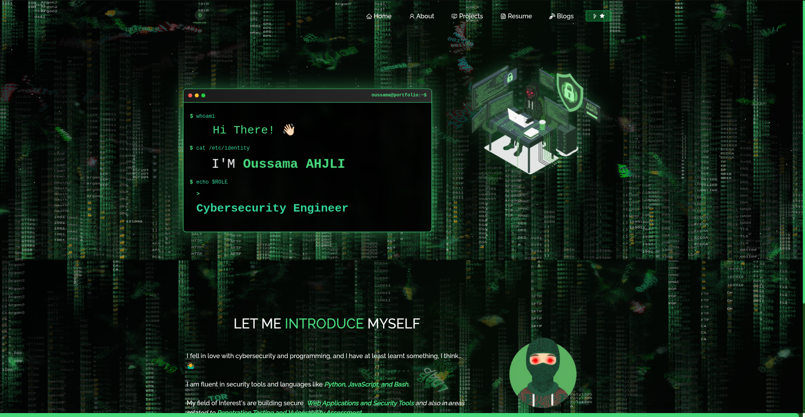

<div align="center">
  
</div>

<h1 align="center">
  
  Cybersecurity Portfolio
  
</h1>

<div align="center">
  
</div>

<br/>

<div align="center">

[](https://forthebadge.com)
[](https://forthebadge.com)
[](https://forthebadge.com)


</div>

<div align="center">
  <h3>
    🔗 <a href="#" target="_blank">Live Demo</a> |
    🐛 <a href="https://github.com/SaamNoLimits/Portfolio-Oussama/issues">Report Bug</a> |
    ✨ <a href="https://github.com/SaamNoLimits/Portfolio-Oussama/issues">Request Feature</a>
  </h3>
</div>

---

## 🚀 About This Portfolio


This is my professional portfolio showcasing my expertise in **Cybersecurity** and **Artificial Intelligence**. Built with modern web technologies and featuring:

- 🛡️ **Cybersecurity Focus**: Specialized in threat detection, security automation, and infrastructure protection
- 🤖 **AI Integration**: Machine learning models for malware detection and security enhancement
- 🎨 **Dynamic UI**: Matrix-style cryptography background with real-time animations
- 🌐 **Responsive Design**: Optimized for all devices and screen sizes
- ⚡ **Performance**: Fast loading with optimized assets and code splitting

<br clear="right"/>

## 🛠️ Tech Stack

<div align="center">

### Frontend


### Tools & Deployment


</div>

## ✨ Key Features

<table>
<tr>
<td width="50%">

### 🎯 Professional Sections
- **🏠 Home**: Dynamic terminal animation with Matrix background
- **👨‍💻 About**: Comprehensive skills and experience overview
- **🚀 Projects**: 6 cybersecurity and AI projects showcase
- **📄 Resume**: Downloadable CV with detailed qualifications
- **📧 Contact**: Multiple ways to connect and collaborate

</td>
<td width="50%">

### 🎨 Visual Excellence
- **🌊 Animated Background**: Real-time cryptography matrix effect
- **💚 Green Theme**: Cybersecurity-inspired color palette
- **📱 Responsive Design**: Perfect on desktop, tablet, and mobile
- **⚡ Smooth Animations**: Engaging user interactions
- **🔤 Dynamic Typing**: Animated text effects

</td>
</tr>
</table>

## 🔐 Featured Projects

<div align="center">

| Project | Description | Technologies |
|---------|-------------|-------------|
| 🛡️ **Malware Detection Pipeline** | Automated threat detection using ML/DL | Python, ML, YARA |
| 🤖 **AI Security Agent** | Autonomous incident response system | Python, Wazuh, ELK |
| 🌐 **IoT Security System** | Real-time intrusion detection | ML, Blockchain, Python |
| 🎣 **Phishing Detection** | Advanced email threat analysis | NLP, TensorFlow, Python |
| 🎬 **Secure File Protection** | Blockchain-based content security | OWASP, Cryptography, Node.js |
| 🏗️ **Infrastructure Automation** | DevOps security automation | Ansible, YAML, Linux |

</div>

## 🚀 Quick Start

```bash
# Clone the repository
git clone https://github.com/SaamNoLimits/Portfolio-Oussama.git

# Navigate to project directory
cd Portfolio-Oussama

# Install dependencies
npm install

# Start development server
npm start

# Open http://localhost:3000 in your browser
```

## 📁 Project Structure

```
Portfolio-Oussama/
├── public/
│   ├── index.html
│   └── favicon.png
├── src/
│   ├── components/
│   │   ├── About/
│   │   ├── Home/
│   │   ├── Projects/
│   │   ├── Resume/
│   │   └── CryptoBackground.js
│   ├── Assets/
│   └── style.css
├── package.json
└── README.md
```

## 🎨 Customization

### Color Theme
The portfolio uses a cybersecurity-inspired green theme. To customize colors, edit the CSS variables in `src/style.css`:

```css
:root {
  --imp-text-color: #4ade80;  /* Primary green */
  --dark-green: #166534;       /* Dark green */
  --medium-green: #22c55e;     /* Medium green */
}
```

### Content Updates
Update your personal information in:
- `src/components/Home/Home.js` - Name and introduction
- `src/components/About/AboutCard.js` - Personal details
- `src/components/Projects/Projects.js` - Project information
- `src/Assets/` - Replace images with your own

## 📊 Performance

<div align="center">


</div>

## 🤝 Contributing

Contributions, issues, and feature requests are welcome! Feel free to check the [issues page](https://github.com/SaamNoLimits/Portfolio-Oussama/issues).

1. Fork the Project
2. Create your Feature Branch (`git checkout -b feature/AmazingFeature`)
3. Commit your Changes (`git commit -m 'Add some AmazingFeature'`)
4. Push to the Branch (`git push origin feature/AmazingFeature`)
5. Open a Pull Request

## 📞 Connect With Me

<div align="center">

[](https://www.linkedin.com/in/oussama-ahjli/)
[](https://github.com/SaamNoLimits)
[](mailto:ahjli.contact@gmail.com)
[](https://www.instagram.com/Oussama.AHJLI)

</div>

## 📄 License

This project is open source and available under the [MIT License](LICENSE).

---

<div align="center">
  
  
  ### Show your support by giving a ⭐ if you like this project!
  
   <em><b>I love connecting with different people</b> so if you want to say <b>hi, I'll be happy to meet you more!</b> 😊</em>
</div>
